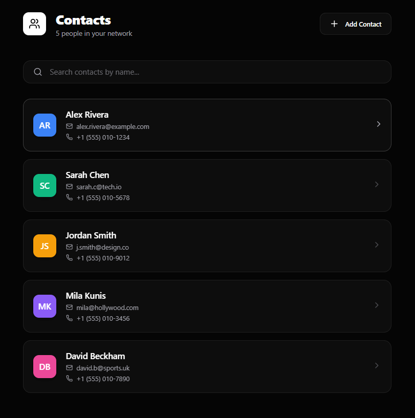
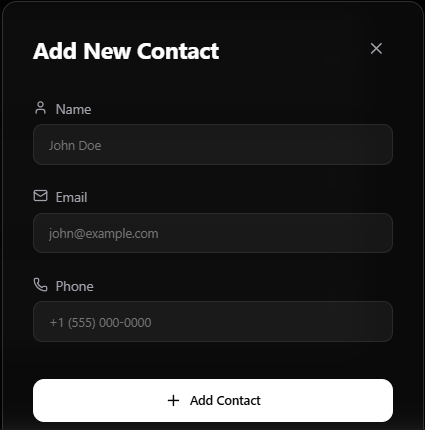
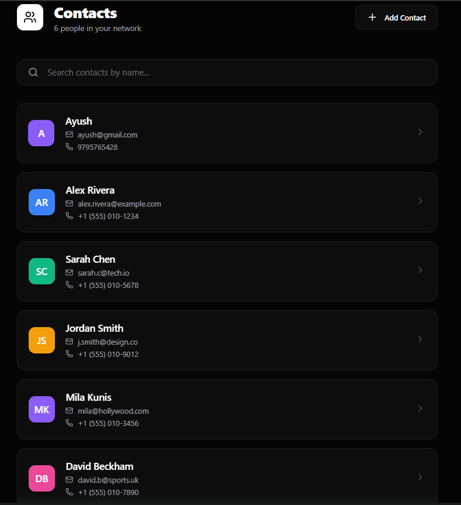
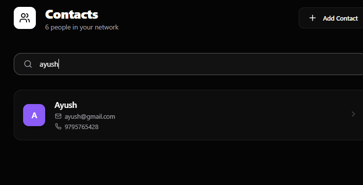
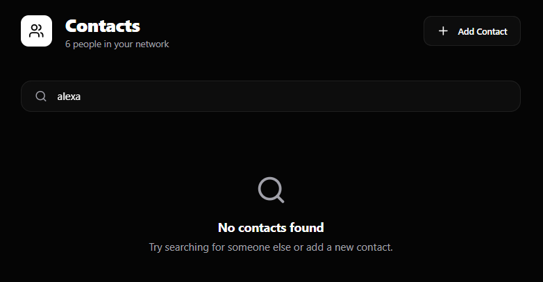

# Tria Contact List - Production Grade Solution

[](https://reactjs.org/)
[](https://vitejs.dev/)
[](https://www.framer.com/motion/)
[](https://lucide.dev/)

A high-performance, aesthetically pleasing Contact Management System designed for the Tria Selection Process. This application demonstrates advanced frontend engineering principles, including glassmorphism, fluid animations, and robust state management.

## 🖼️ Application Showcase

<div align="center">
  
  
  <br />
  
  
  <br />
  
</div>

---

## 🌟 Key Features

### 1. **Premium Glassmorphism UI**
- Utilizes `backdrop-filter: blur()` and high-end color palettes to create a modern SaaS aesthetic.
- Custom scrollbars and sleek typography (Inter) for a premium feel.

### 2. **Fluid Animations**
- **List Reordering**: Uses Framer Motion's `layout` prop for seamless filtering transitions.
- **Micro-interactions**: Hover effects on cards, button scales, and modal transitions that feel alive.
- **Entrance Effects**: Staggered animations when the list first loads.

### 3. **Intelligent Search**
- Real-time filtering with high performance.
- Case-insensitive matching across contact names.
- Empty states with visual feedback when no matches are found.

### 4. **Smart Contact Creation**
- Automatic generation of avatar initials.
- Dynamic color assignment for avatars.
- Form validation to prevent empty entries.

### 5. **Mock API Integration**
- Simulated network latency to demonstrate UX handling of loading states.
- Clean separation of concerns between data and presentation layers.

---

## 🛠️ Technical Implementation

### **Architecture**
The project follows an Atomic Design-inspired structure:
- **Components**: Modularized elements for high reusability.
- **State Management**: React `useState` hooks with centralized logic in `App.jsx`.
- **Styling**: Vanilla CSS with Global Variables for consistency and performance.

### **Performance Optimization**
- **Vite**: Ultra-fast HMR and optimized production builds.
- **Framer Motion**: Optimized transform animations that run on the GPU.
- **Lucide React**: Tree-shakable icons for minimal bundle size.

---

## 🚀 Installation & Setup

1. **Clone & Enter Directory**:
   ```bash
   git clone https://github.com/AYUSHSANI9876/Tria_Frontend_Developer_V2.git
   cd Tria_Frontend_Developer_V2
   ```

2. **Install Dependencies**:
   ```bash
   npm install
   ```

3. **Start Development Server**:
   ```bash
   npm run dev
   ```

4. **Production Build**:
   ```bash
   npm run build
   ```

---

## 🧠 Design Philosophy
> "Simplicity is the ultimate sophistication."
The goal was to create a contact list that doesn't just work, but feels **premium**. By focusing on motion, spacing, and contrast, the app provides a user experience that rivals high-end productivity tools.

---
Built with passion for **Tria**.
